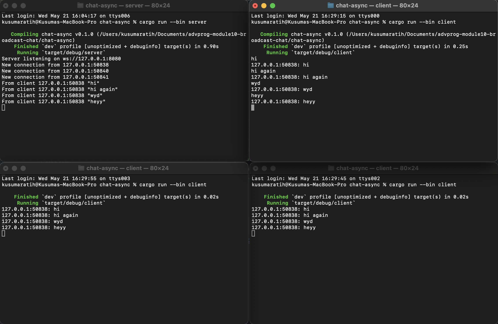
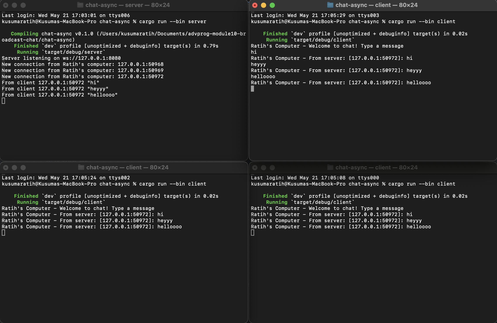

## Kusuma Ratih Hanindyani - 2306256406

### 2.1. Original code of broadcast chat

I first ran the server using the command `cargo run --bin server` and once the server was running and listening on port 2000, I opened three additional terminals and ran `cargo run --bin client`.
Each time a client connected, the server printed a new connection message showing the client's address. 
When I typed messages into any of the clients, those messages were first received by the server, then broadcast back to all clients using a broadcast channel. 
As a result, every message typed in any client appeared in all clients' terminals, including the sender’s. 
Each message was prefixed with the sender’s address, making it easy to identify the source.

### 2.2 Modifying the websocket port

The original application used port 2000 for both the WebSocket server and client. 
I updated both to use port 8080 instead.
In `client.rs` I changed ```ClientBuilder::from_uri(Uri::from_static("ws://127.0.0.1:8080"))``` and
in `server.rs` I changed ```let listener = TcpListener::bind("127.0.0.1:8080").await?;```.
After making these changes, I restarted the server and then launched the clients.
Everything continued to work as expected. 
The server printed “Server listening on ws://127.0.0.1:8080” and successfully accepted incoming client connections.
No other configuration was needed aside from updating the hardcoded URI and bind address in the code. 
This shows that the WebSocket protocol (ws://) and the broadcast mechanism are not affected by the specific port number used, as long as both the server and clients agree on which port to communicate through.

### 2.3 Small changes. Add some information to client

I updated the server’s message format to make it more informative and readable.
The server now sends messages in the format `Ratih's Computer - From server [IP:PORT]: message`.
This makes it clear that the message is coming through the server and identifies which client originally sent it.
I also updated the log for new connections in the main() function of the server to show
`New connection from Ratih's computer: {addr}`.
On the client side, I added a simple welcome message that shows when a client connects
`Ratih's Computer – Welcome to chat! Type a message`.
These small changes make the chat output easier to follow, especially when multiple clients are active, and help distinguish between system output and user messages.