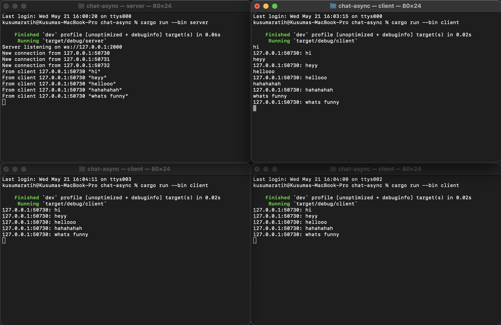

## Kusuma Ratih Hanindyani - 2306256406

### 2.1. Original code of broadcast chat

I first ran the server using the command `cargo run --bin server` and once the server was running and listening on port 2000, I opened three additional terminals and ran `cargo run --bin client`.
Each time a client connected, the server printed a new connection message showing the client's address. 
When I typed messages into any of the clients, those messages were first received by the server, then broadcast back to all clients using a broadcast channel. 
As a result, every message typed in any client appeared in all clients' terminals, including the sender’s. 
Each message was prefixed with the sender’s address, making it easy to identify the source.

